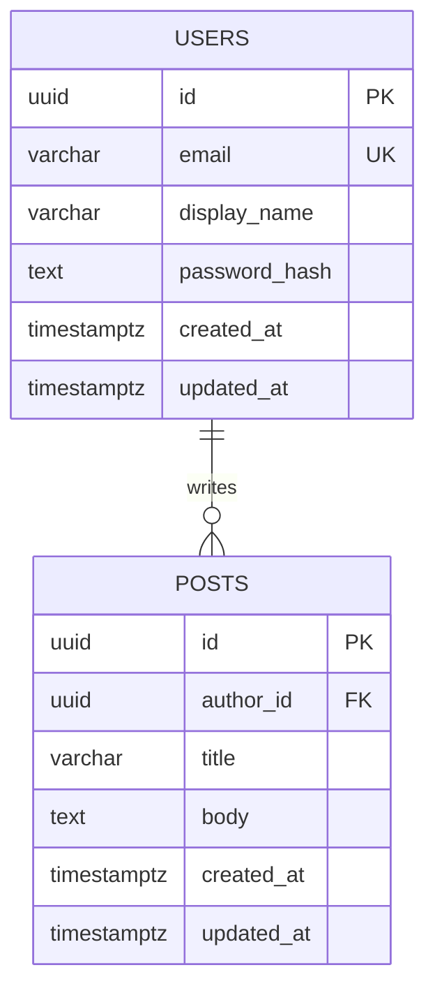

# Mini User and Post API

A REST API with public posts, user accounts, and author-only editing. PostgreSQL stores users, posts, sessions, and rate-limit counters. The implementation follows [SPECS.md](SPECS.md); its Mermaid ERD describes the User-to-Post relationship.

## Technology and features

- Node.js and Express 5 with modular routes, controllers, services, and repositories.
- PostgreSQL exclusively in development, testing, and production, with versioned SQL migrations and parameterized queries.
- Registration and login with Argon2id password hashing and PostgreSQL-backed sessions.
- Session-bound CSRF tokens, input validation with Zod, security headers, and PostgreSQL-backed rate limiting.
- Public post listing and reading, with creation for authenticated users and updates/deletion restricted to the author.
- OpenAPI documentation and integration tests against a real PostgreSQL database.

## Requirements

- Node.js 22.13+ or 24+ (developed with Node.js 24).
- PostgreSQL 16 or newer (integration tests use the locally installed PostgreSQL server binaries; developed with PostgreSQL 18).
- npm.

Run the following commands from the repository root. PostgreSQL's command-line tools are required for the local database and isolated test helpers; a running PostgreSQL service alone is not sufficient.

## Start locally

```powershell
npm ci
npm run db:start
npm run db:migrate
npm start
```

The local database helper creates an isolated PostgreSQL cluster under `.local/development`, bound to `127.0.0.1:55432`. It does not change an existing PostgreSQL service. It creates a non-superuser application role and generates `.env` with random credentials and a session secret. Keep `.local` and `.env` private; both are ignored by Git.

The helper finds PostgreSQL under `C:/Program Files/PostgreSQL` on Windows. On other systems, put `initdb` and `pg_ctl` on PATH, or set `PG_BIN` to their directory. Run these helpers as a regular user, not root. If port 55432 is occupied, edit `.local/development/settings.json` before starting the cluster.

An existing `.env` is preserved. In that case, the helper writes `.local/development/generated.env`; copy the desired settings into your `.env`. Migrations are an explicit step and are safe to run again. `npm run dev` restarts the API when source files change.

The API listens at `http://localhost:3000/api/v1`. Stop the API with Ctrl+C; stop the local database with:

```powershell
npm run db:stop
```

Stopping the database preserves its data. On subsequent runs, `npm run db:start` reuses the cluster.

### Use your own PostgreSQL instance

Create a dedicated database and non-superuser login, copy `.env.example` to `.env`, and set `DATABASE_URL` and a random `SESSION_SECRET` of at least 32 characters. Generate a secret with `node -e "console.log(require('node:crypto').randomBytes(48).toString('hex'))"`. Then run `npm run db:migrate` and `npm start`.

The local application role owns its database to support migrations. In production, run migrations with a separate owner role and give the runtime role only CONNECT, schema USAGE, and SELECT/INSERT/UPDATE/DELETE on `users`, `posts`, `sessions`, and `rate_limits`, plus SELECT on `schema_migrations`. The API never creates tables automatically.

## Command reference

| Command | Purpose |
| --- | --- |
| `npm ci` | Install the dependency versions recorded in the lockfile |
| `npm run db:start` | Initialize or start the persistent local PostgreSQL cluster |
| `npm run db:stop` | Stop the local PostgreSQL cluster while preserving its data |
| `npm run db:migrate` | Apply pending database migrations using `DATABASE_URL` |
| `npm start` | Start the API |
| `npm run dev` | Start the API with automatic restart on source changes |
| `npm run lint` | Check JavaScript with ESLint |
| `npm run docs:check` | Validate the OpenAPI document |
| `npm test` | Run integration tests using a temporary PostgreSQL cluster |
| `npm run test:integration` | Run tests against the disposable database in `TEST_DATABASE_URL` |

## Database relationship

One user can write many posts; every post has exactly one author. PostgreSQL prevents deletion of a user who still owns posts.



Supporting tables are `sessions` for session state, `rate_limits` for shared request counters, and `schema_migrations` for applied migrations. Password hashes and private author fields are excluded from public post responses.

## Endpoints

| Method | Path under `/api/v1` | Access |
| --- | --- | --- |
| GET | `/auth/csrf` | Public; creates an anonymous session if needed |
| POST | `/auth/register` | Anonymous or authenticated session + CSRF |
| POST | `/auth/login` | Anonymous or authenticated session + CSRF |
| POST | `/auth/logout` | Authenticated + CSRF |
| GET | `/users/me` | Authenticated |
| GET | `/posts?page=1&limit=20` | Public |
| GET | `/posts/:id` | Public |
| POST | `/posts` | Authenticated + CSRF |
| PATCH | `/posts/:id` | Author + CSRF |
| DELETE | `/posts/:id` | Author + CSRF |

See [docs/openapi.yaml](docs/openapi.yaml) for the machine-readable contract, and [SPECS.md](SPECS.md) for examples and error codes. All post content is public plain text. Frontends must escape it when rendering. There are no drafts, administrative roles, uploads, password recovery, or email verification.

### Request and response rules

Send request bodies as UTF-8 `application/json`, up to 64 KiB. Unknown body fields are rejected. IDs are UUIDs and timestamps use ISO 8601 UTC. Successful single-resource responses use `{ "data": ... }`; lists also include `pagination` with `page`, `limit`, and `total`.

Post titles contain 1–200 characters after trimming. Bodies contain 1–10,000 characters and must not be whitespace-only. PATCH accepts `title`, `body`, or both; omitted fields remain unchanged. Pagination defaults to `page=1&limit=20`, with a maximum limit of 100 and stable ordering by creation time and ID, both descending.

Errors have a consistent shape:

```json
{
  "error": {
    "code": "VALIDATION_ERROR",
    "message": "Request validation failed.",
    "details": [{ "field": "title", "message": "Title is required." }]
  }
}
```

The `details` array is optional, and validation messages depend on the failed rule.

| Status | Meaning |
| --- | --- |
| `400` | Invalid JSON, fields, ID, or pagination |
| `401` | Missing/expired authentication or incorrect credentials |
| `403` | Invalid CSRF token, disallowed origin, non-author mutation, or HTTP in production |
| `404` | Unknown route or missing post |
| `409` | Email already registered |
| `413` | Request body exceeds 64 KiB |
| `415` | Unsupported content type, encoding, or compression |
| `429` | Rate limit exceeded; check `Retry-After` |
| `500` | Unexpected server error; internal details are withheld |

## Complete PowerShell walkthrough

Run this in a second PowerShell terminal while the API is running. `-SessionVariable` and `-WebSession` retain the session cookie. Use a fresh email address when repeating registration.

```powershell
$apiBase = 'http://localhost:3000/api/v1'
$csrf = Invoke-RestMethod "$apiBase/auth/csrf" -SessionVariable apiSession
$headers = @{ 'X-CSRF-Token' = $csrf.data.csrfToken }
$credentials = @{ email = 'alex@example.com'; password = 'a-long-example-passphrase' }
$registration = @{
    email = $credentials.email
    password = $credentials.password
    displayName = 'Alex'
} | ConvertTo-Json

# Registration does not log you in.
Invoke-RestMethod "$apiBase/auth/register" -Method Post -WebSession $apiSession `
    -Headers $headers -ContentType 'application/json' -Body $registration

# Login rotates both session ID and CSRF token.
Invoke-RestMethod "$apiBase/auth/login" -Method Post -WebSession $apiSession `
    -Headers $headers -ContentType 'application/json' -Body ($credentials | ConvertTo-Json)
$csrf = Invoke-RestMethod "$apiBase/auth/csrf" -WebSession $apiSession
$headers = @{ 'X-CSRF-Token' = $csrf.data.csrfToken }

Invoke-RestMethod "$apiBase/users/me" -WebSession $apiSession
$postBody = @{ title = 'My first post'; body = 'Hello from PostgreSQL.' } | ConvertTo-Json
$created = Invoke-RestMethod "$apiBase/posts" -Method Post -WebSession $apiSession `
    -Headers $headers -ContentType 'application/json' -Body $postBody
$postId = $created.data.id

Invoke-RestMethod "$apiBase/posts?page=1&limit=20"
Invoke-RestMethod "$apiBase/posts/$postId"
Invoke-RestMethod "$apiBase/posts/$postId" -Method Patch -WebSession $apiSession `
    -Headers $headers -ContentType 'application/json' -Body '{"title":"Updated title"}'
Invoke-RestMethod "$apiBase/posts/$postId" -Method Delete -WebSession $apiSession -Headers $headers
Invoke-RestMethod "$apiBase/auth/logout" -Method Post -WebSession $apiSession -Headers $headers
```

DELETE and logout return `204` with no body. Every state-changing request requires `X-CSRF-Token`; authenticated operations also require a valid session. Non-browser clients may omit Origin but must still provide cookies and CSRF tokens.

## Configuration

| Variable | Default / requirement |
| --- | --- |
| `NODE_ENV` | `development`; accepts `development`, `test`, `production` |
| `DATABASE_URL` | Required PostgreSQL URL |
| `SESSION_SECRET` | Required random secret, at least 32 characters |
| `HOST`, `PORT` | `127.0.0.1`, `3000` |
| `APP_ORIGIN` | `http://localhost:3000`; exact origin, no trailing slash |
| `CORS_ORIGINS` | Empty; comma-separated exact permitted frontend origins |
| `TRUST_PROXY` | Empty; explicit trusted proxy IP addresses/CIDRs only |
| `GLOBAL_RATE_LIMIT` | 100 requests per minute per IP |
| `AUTH_RATE_LIMIT` | 10 combined registration/login attempts per 15 minutes per IP |
| `PG_BIN` | Optional PostgreSQL binary directory for local/test helpers |
| `TEST_DATABASE_URL` | Only needed for `npm run test:integration` |

Production requires HTTPS origins and rejects requests that are not HTTPS. When terminating TLS at a reverse proxy, set `TRUST_PROXY` to that proxy's actual IP/CIDR and prevent direct access to the backend. The proxy must replace forwarded headers. Untrusted forwarded headers are ignored.

Cookies are `HttpOnly`, `SameSite=Lax`, and `Secure` in production. The local HTTP override is automatic only for development/test. Sessions expire after 24 hours without sliding renewal. Login rotates the session ID and CSRF token; logout deletes the server-side session. Expired sessions and rate-limit rows are cleaned up periodically. CORS is disabled by default; enabled origins must be explicit. With SameSite=Lax, browser frontends should share the API's site even if they use a different port or subdomain.

## Verification

```powershell
npm run lint
npm run docs:check
npm test
npm audit
```

`npm test` initializes a fresh PostgreSQL cluster at an available loopback port, creates `mini_api_test`, runs migrations and HTTP integration tests, and stops and removes that test cluster afterward. It uses SCRAM authentication with a random temporary password. No Docker, SQLite, in-memory database, or access to an existing PostgreSQL service is needed.

To use an existing **disposable** PostgreSQL test database, set `TEST_DATABASE_URL` and run `npm run test:integration`. Its database name must end in `_test` and it must differ from the application database. The suite truncates application tables in that test database; never point it at data you need to keep.

Tests exercise registration, Argon2id hashes, generic login failures, session/CSRF rotation and expiry, logout replay, ownership, database constraints, SQL injection handling, pagination, invalid requests, rate limiting across instances, production HTTPS/cookies, CORS, sanitized errors, and persistence across application recreation. Tests do not substitute a different database engine.

## Code layout

```text
src/
  app.js            Express application factory
  server.js         Startup and graceful shutdown
  config/           Environment validation
  db/               PostgreSQL pool, migration runner, SQL migrations
  routes/           Endpoint and middleware composition
  controllers/      HTTP request and response handling
  services/         Authentication and ownership rules
  repositories/     Parameterized PostgreSQL queries
  middleware/       Sessions, CSRF, security, rate limits, errors
  validators/       Request schemas
scripts/            Local/test database helpers and OpenAPI validation
tests/integration/  HTTP and PostgreSQL integration tests
docs/               OpenAPI contract and security control mapping
```

Routes select middleware and controllers. Controllers handle HTTP, services apply business rules, and repositories execute parameterized SQL. `src/db/migrations` contains ordered, transactional SQL migrations, serialized with a PostgreSQL advisory lock. `src/app.js` exports a testable application factory; `src/server.js` owns startup and shutdown.

## Troubleshooting

| Problem | What to check |
| --- | --- |
| PostgreSQL tools cannot be found | Set `$env:PG_BIN = 'C:\Program Files\PostgreSQL\18\bin'` in PowerShell, adjusting the version/path to your installation |
| Local PostgreSQL fails to start | Read `.local/development/postgres.log`; check whether port 55432 is occupied |
| API reports startup failure | Check `.env`, start PostgreSQL, and run `npm run db:migrate` |
| Existing `.env` points to another database | Review `.local/development/generated.env` after `db:start` and copy the intended settings |
| `403 INVALID_CSRF_TOKEN` after login | Fetch `/auth/csrf` again using the same cookie session; login rotates the token |
| `401` on protected endpoints | Log in and retain the session cookie on subsequent requests |
| `429` during repeated walkthroughs | Wait for `Retry-After`; registration and login share an authentication rate limit |
| Browser requests fail but PowerShell works | Check exact configured origins, frontend cookie credentials, and SameSite requirements |
| PostgreSQL cannot start under a restricted runner | Run the test helper in an environment permitted to launch a local PostgreSQL process |

Use `/api/v1/posts` for a public API request. The root URL `/` has no route and intentionally returns `404`.

## Security decisions and remaining deployment work

- Passwords use Argon2id with a per-password salt, 19 MiB memory, two iterations, and one lane. Passwords are never trimmed or logged.
- Registration returns `409` for an existing email, intentionally revealing account existence for this course project. Login returns the same message for unknown users and incorrect passwords and checks a dummy hash for unknown users.
- Validation rejects unknown body fields and ownership changes. All SQL values are parameterized. Post mutations also constrain the author in SQL.
- JSON bodies are limited to 64 KiB; compressed bodies are rejected. Helmet sets security headers. Responses use `Cache-Control: no-store`.
- Rate limits use atomic PostgreSQL counters shared by all instances. IP keys are HMAC digests. These limits are a baseline, not a substitute for an edge proxy's traffic controls.
- Error logging uses only an event name and generated request ID; request bodies, cookies, SQL messages, and secrets are not logged.
- Before production deployment, configure TLS, a least-privilege runtime role, backups/restore procedures, database connection encryption as required by your host, and suitable rate limits. Keep the lockfile and review dependency advisories.

The course's specific security-topic list was not supplied. [docs/security.md](docs/security.md) maps the implemented controls and identifies the remaining course review; it does not claim that an unseen checklist has been completed.

Implementation references: [Express error handling](https://expressjs.com/en/guide/error-handling/), [express-session](https://github.com/expressjs/session), [connect-pg-simple](https://github.com/voxpelli/node-connect-pg-simple), and [node-argon2](https://github.com/ranisalt/node-argon2).
