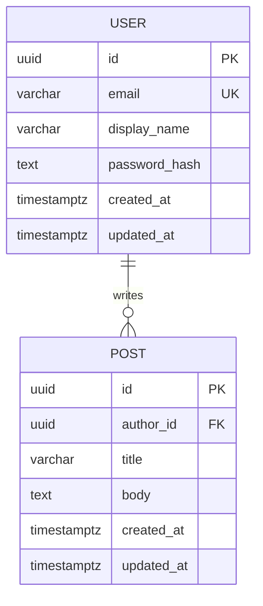

# Mini API Specification

## Purpose and scope

Build a database-backed REST API that meets the requirements in `AGENTS.md`: at least two endpoints, two related entities, security controls, modular code, and documented request/response formats and an entity-relationship diagram.

This document proposes a **User and Post API** because no existing implementation or domain is present. PostgreSQL is required as the only database in development, testing, and production. Other technology choices below are proposed implementation decisions. This is a plan; features described here are not yet implemented.

## Proposed stack

- Node.js with Express for HTTP routing and middleware.
- PostgreSQL as the only database for persistent storage, with versioned migrations and parameterized queries. Integration tests must use an isolated PostgreSQL database rather than a substitute database engine.
- Server-side sessions for authentication, stored in PostgreSQL.
- JSON request and response bodies under `/api/v1`.

## Functional requirements

1. Visitors can register an account and log in.
2. Authenticated users can log out and read their own profile.
3. Anyone can list and read published posts. All posts are public; drafts and private posts are out of scope.
4. Authenticated users can create posts. The server assigns the author from the session.
5. Only the author can update or delete a post.
6. Users and posts persist across application restarts.

Administrative roles, file uploads, account deletion, email verification, and password recovery are outside the initial scope.

## Data model

### User

| Field | Type | Constraints |
| --- | --- | --- |
| id | UUID | Primary key, generated by server |
| email | VARCHAR(254) | Required, unique, trimmed and lowercased before storage |
| display_name | VARCHAR(80) | Required, trimmed, 1–80 characters |
| password_hash | TEXT | Required; never returned by the API |
| created_at | TIMESTAMPTZ | Required, defaults to current time |
| updated_at | TIMESTAMPTZ | Required, updated on modification |

### Post

| Field | Type | Constraints |
| --- | --- | --- |
| id | UUID | Primary key, generated by server |
| author_id | UUID | Required, foreign key to User.id, deletion restricted |
| title | VARCHAR(200) | Required, trimmed, 1–200 characters |
| body | TEXT | Required, 1–10,000 characters, not whitespace-only |
| created_at | TIMESTAMPTZ | Required, defaults to current time |
| updated_at | TIMESTAMPTZ | Required, updated on modification |

Index `Post.author_id` for author lookups and `(created_at, id)` for deterministic listing. Enforce uniqueness, required fields, and foreign keys in the database as well as validating inputs in the application.

### Entity-relationship diagram



A user may have zero or more posts. Every post belongs to exactly one user. The session store is supporting infrastructure and must also have a migration and expiry cleanup.

## API contract

Use camelCase in JSON and ISO 8601 UTC timestamps. IDs are UUID strings. Reject unknown body fields. Requests with a body must use `Content-Type: application/json`.

| Method | Endpoint | Access | Input | Success |
| --- | --- | --- | --- | --- |
| GET | `/api/v1/auth/csrf` | Public | None | `200` with CSRF token bound to an anonymous or authenticated session |
| POST | `/api/v1/auth/register` | Public + CSRF | `email`, `displayName`, `password` | `201` with own user profile; does not log in |
| POST | `/api/v1/auth/login` | Public + CSRF | `email`, `password` | `200` with own user profile; sets session cookie |
| POST | `/api/v1/auth/logout` | Authenticated + CSRF | None | `204`; invalidates session and clears cookie |
| GET | `/api/v1/users/me` | Authenticated | None | `200` with own user profile |
| GET | `/api/v1/posts` | Public | Optional `page` and `limit` query parameters | `200` with paginated posts |
| GET | `/api/v1/posts/:id` | Public | Post UUID | `200` with post |
| POST | `/api/v1/posts` | Authenticated + CSRF | `title`, `body` | `201` with post and `Location` header |
| PATCH | `/api/v1/posts/:id` | Author + CSRF | `title` and/or `body`; at least one required | `200` with updated post |
| DELETE | `/api/v1/posts/:id` | Author + CSRF | Post UUID | `204` with no body |

The client first retrieves a CSRF token and sends it in `X-CSRF-Token` for every POST, PATCH, and DELETE request, including registration and login. Login rotates the session ID and CSRF token; the client then retrieves a fresh token.

### Registration example

`POST /api/v1/auth/register`

```json
{
  "email": "alex@example.com",
  "displayName": "Alex",
  "password": "a-long-example-passphrase"
}
```

`201 Created`

```json
{
  "data": {
    "id": "c3ec1903-d923-4b9b-b0bf-670885127c29",
    "email": "alex@example.com",
    "displayName": "Alex",
    "createdAt": "2026-09-20T10:00:00.000Z",
    "updatedAt": "2026-09-20T10:00:00.000Z"
  }
}
```

Login and `/users/me` use the same profile shape. Public post authors expose only `id` and `displayName`.

### Post creation example

`POST /api/v1/posts`

```json
{
  "title": "My first post",
  "body": "Hello from the mini API."
}
```

`201 Created`, with `Location: /api/v1/posts/61801b0f-87ab-44ef-ae62-d7a388a08741`

```json
{
  "data": {
    "id": "61801b0f-87ab-44ef-ae62-d7a388a08741",
    "title": "My first post",
    "body": "Hello from the mini API.",
    "author": {
      "id": "c3ec1903-d923-4b9b-b0bf-670885127c29",
      "displayName": "Alex"
    },
    "createdAt": "2026-09-20T10:05:00.000Z",
    "updatedAt": "2026-09-20T10:05:00.000Z"
  }
}
```

Reading or updating a post returns the same shape. PATCH preserves omitted fields and rejects null values.

### Pagination

`GET /api/v1/posts?page=1&limit=20` defaults to page 1 and limit 20. Both parameters must be positive integers; limit must not exceed 100. Sort by `created_at DESC, id DESC`. An empty or out-of-range page returns an empty array.

```json
{
  "data": [],
  "pagination": {
    "page": 1,
    "limit": 20,
    "total": 0
  }
}
```

### Errors

```json
{
  "error": {
    "code": "VALIDATION_ERROR",
    "message": "Request validation failed.",
    "details": [
      { "field": "title", "message": "Title is required." }
    ]
  }
}
```

`details` is optional and must never echo passwords or other secrets.

| Status | Meaning |
| --- | --- |
| 400 | Invalid input, malformed JSON, invalid UUID, or invalid pagination |
| 401 | Missing/expired session or incorrect login credentials |
| 403 | Authenticated non-author or missing/invalid CSRF token |
| 404 | Unknown route or post not found |
| 409 | Email already registered |
| 413 | Request body exceeds size limit |
| 415 | Unsupported request content type |
| 429 | Rate limit exceeded; include `Retry-After` |
| 500 | Unexpected error; generic response without implementation details |

## Security requirements

- Hash passwords with Argon2id using a maintained library and a unique salt. Accept passwords of 15–128 characters without silently trimming or truncating them. Never store or log plaintext passwords.
- Return the same login failure message for an unknown email and an incorrect password. Registration's `409` response reveals account existence; document this tradeoff in the README.
- Use an opaque session cookie with `HttpOnly`, `SameSite=Lax`, and `Secure` in production. Expire sessions after 24 hours, rotate IDs on login, and invalidate them on logout. Development HTTP requires a documented local-only cookie override.
- Protect state-changing routes with session-bound CSRF tokens and validate allowed origins. Apply the same protection to login and registration.
- Enforce ownership on the server for every update and delete. Never accept client-provided author IDs or ownership changes.
- Validate request bodies, route parameters, and query parameters. Limit JSON payloads to 64 KiB. Use parameterized SQL and allowlisted update fields.
- Treat post content as plain text. Clients must escape content when rendering it; the API must not execute or render submitted HTML.
- Use security headers, disable framework identification headers, and require HTTPS in production. Keep CORS disabled for same-origin deployments or allow only explicitly configured frontend origins with credentials; never use wildcard credentialed access.
- Start with rate limits of 100 requests/minute/IP globally and 10 authentication attempts/15 minutes/IP. Make limits configurable and verify trusted proxy settings before relying on client IPs. Use a shared PostgreSQL-backed limiter store if deploying multiple instances.
- Keep database credentials and session secrets in environment variables. Commit only an `.env.example` with placeholders. Use a least-privilege database account.
- Centralize errors and redact cookies, authorization headers, passwords, and secrets from logs. Never expose SQL errors or stack traces in API responses.
- Keep dependencies locked and review security advisories before release. Map these controls against the course's actual security topics before submission, since `AGENTS.md` does not enumerate them.

## Code organization

```text
src/
  app.js                 # Express composition, exported for integration tests
  server.js              # Startup and graceful shutdown
  config/                # Validated environment configuration
  db/                    # Connection pool and migrations
  routes/                # Routes and middleware composition
  controllers/           # HTTP input/output handling
  services/              # Business rules and authorization
  repositories/          # Parameterized database operations
  middleware/            # Authentication, CSRF, rate limits, errors
  validators/            # Request schemas
tests/
  integration/           # API tests against an isolated test database
docs/
  openapi.yaml           # Machine-readable API contract
```

Keep route handlers small, centralize repeated behavior, and avoid circular dependencies. Validate required configuration at startup. Close the HTTP server and database pool on shutdown. Use transactions for operations that require multiple dependent writes.

## Implementation plan

1. Initialize the application, configuration validation, linting, and database connection.
2. Add migrations for users, posts, and sessions, including constraints and indexes.
3. Implement validation, error handling, security middleware, and authentication.
4. Implement post listing, retrieval, creation, and ownership-protected mutations.
5. Add integration tests using a separate PostgreSQL database and deterministic fixtures.
6. Write a README with installation, environment setup, migrations, startup commands, test commands, and a complete cookie/CSRF request walkthrough. Publish the endpoint contract in OpenAPI and retain the ERD.

## Acceptance criteria and verification

- Migrations create a working schema on a fresh PostgreSQL database; persisted posts remain available after an application restart.
- Registration, login, profile retrieval, logout, and the full post lifecycle work through HTTP using the documented formats and status codes.
- Duplicate emails are rejected, passwords are hashed, and neither hashes nor private user fields appear in public post responses.
- Unauthenticated writes fail. A second user cannot update or delete the first user's posts, including by submitting forged ownership fields.
- Missing/invalid CSRF tokens fail; expired and logged-out sessions cannot authenticate requests.
- Invalid JSON, oversized payloads, unsupported content types, invalid IDs, empty patches, and invalid pagination receive documented errors.
- SQL injection strings are handled as data; unknown properties cannot change protected fields.
- Pagination is bounded and deterministic; empty results and missing posts are handled correctly.
- Rate limits produce `429` responses. Unexpected server errors do not reveal stack traces, SQL, or secrets.
- Automated integration tests verify these behaviors against PostgreSQL with real database constraints. Development, testing, and production use PostgreSQL exclusively as their database engine. Linting and tests pass before submission.
- README, OpenAPI, and this specification agree with the delivered implementation, and the course security checklist has been reviewed.
